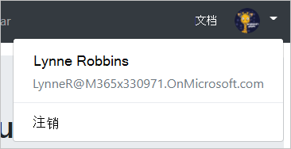

<!-- markdownlint-disable MD002 MD041 -->

<span data-ttu-id="db229-101">在本练习中, 你将扩展上一练习中的应用程序, 以支持 Azure AD 的身份验证。</span><span class="sxs-lookup"><span data-stu-id="db229-101">In this exercise you will extend the application from the previous exercise to support authentication with Azure AD.</span></span> <span data-ttu-id="db229-102">若要获取所需的 OAuth 访问令牌以调用 Microsoft Graph, 这是必需的。</span><span class="sxs-lookup"><span data-stu-id="db229-102">This is required to obtain the necessary OAuth access token to call the Microsoft Graph.</span></span> <span data-ttu-id="db229-103">在此步骤中, 将[Microsoft 身份验证库的角度](https://github.com/AzureAD/microsoft-authentication-library-for-js/blob/dev/lib/msal-angular/README.md)集成到应用程序中。</span><span class="sxs-lookup"><span data-stu-id="db229-103">In this step you will integrate the [Microsoft Authentication Library for Angular](https://github.com/AzureAD/microsoft-authentication-library-for-js/blob/dev/lib/msal-angular/README.md) into the application.</span></span>

<span data-ttu-id="db229-104">在名为`./src` `oauth.ts`的目录中创建一个新文件, 并添加以下代码。</span><span class="sxs-lookup"><span data-stu-id="db229-104">Create a new file in the `./src` directory named `oauth.ts` and add the following code.</span></span>

```TypeScript
export const OAuthSettings = {
  appId: 'YOUR_APP_ID_HERE',
  scopes: [
    "user.read",
    "calendars.read"
  ]
};
```

<span data-ttu-id="db229-105">将`YOUR_APP_ID_HERE`替换为应用程序注册门户中的应用程序 ID。</span><span class="sxs-lookup"><span data-stu-id="db229-105">Replace `YOUR_APP_ID_HERE` with the application ID from the Application Registration Portal.</span></span>

> [!IMPORTANT]
> <span data-ttu-id="db229-106">如果您使用的是源代码管理 (如 git), 现在可以从源代码管理中排除`oauth.ts`该文件, 以避免无意中泄漏您的应用程序 ID。</span><span class="sxs-lookup"><span data-stu-id="db229-106">If you're using source control such as git, now would be a good time to exclude the `oauth.ts` file from source control to avoid inadvertently leaking your app ID.</span></span>

<span data-ttu-id="db229-107">打开`./src/app/app.module.ts`并将以下`import`语句添加到文件顶部。</span><span class="sxs-lookup"><span data-stu-id="db229-107">Open `./src/app/app.module.ts` and add the following `import` statements to the top of the file.</span></span>

```TypeScript
import { MsalModule } from '@azure/msal-angular';
import { OAuthSettings } from '../oauth';
```

<span data-ttu-id="db229-108">然后, 将`MsalModule`添加到`imports` `@NgModule`声明中的数组, 并使用应用 ID 对它进行初始化。</span><span class="sxs-lookup"><span data-stu-id="db229-108">Then add the `MsalModule` to the `imports` array inside the `@NgModule` declaration, and initialize it with the app ID.</span></span>

```TypeScript
imports: [
  BrowserModule,
  AppRoutingModule,
  NgbModule,
  FontAwesomeModule,
  MsalModule.forRoot({
    clientID: OAuthSettings.appId
  })
],
```

## <a name="implement-sign-in"></a><span data-ttu-id="db229-109">实施登录</span><span class="sxs-lookup"><span data-stu-id="db229-109">Implement sign-in</span></span>

<span data-ttu-id="db229-110">首先定义一个简单`User`的类来保存有关应用程序显示的用户的信息。</span><span class="sxs-lookup"><span data-stu-id="db229-110">Start by defining a simple `User` class to hold the information about the user that the app displays.</span></span> <span data-ttu-id="db229-111">在名为`./src/app` `user.ts`的文件夹中创建一个新文件, 并添加以下代码。</span><span class="sxs-lookup"><span data-stu-id="db229-111">Create a new file in the `./src/app` folder named `user.ts` and add the following code.</span></span>

```TypeScript
export class User {
  displayName: string;
  email: string;
  avatar: string;
}
```

<span data-ttu-id="db229-112">现在, 创建身份验证服务。</span><span class="sxs-lookup"><span data-stu-id="db229-112">Now create an authentication service.</span></span> <span data-ttu-id="db229-113">通过为此创建服务, 可以轻松地将其插入到任何需要访问身份验证方法的组件中。</span><span class="sxs-lookup"><span data-stu-id="db229-113">By creating a service for this, you can easily inject it into any components that need access to authentication methods.</span></span> <span data-ttu-id="db229-114">在 CLI 中运行以下命令。</span><span class="sxs-lookup"><span data-stu-id="db229-114">Run the following command in your CLI.</span></span>

```Shell
ng generate service auth
```

<span data-ttu-id="db229-115">命令完成后, 打开`./src/app/auth.service.ts`文件并将其内容替换为以下代码。</span><span class="sxs-lookup"><span data-stu-id="db229-115">Once the command finishes, open the `./src/app/auth.service.ts` file and replace its contents with the following code.</span></span>

```TypeScript
import { Injectable } from '@angular/core';
import { MsalService } from '@azure/msal-angular';

import { AlertsService } from './alerts.service';
import { OAuthSettings } from '../oauth';
import { User } from './user';

@Injectable({
  providedIn: 'root'
})
export class AuthService {
  public authenticated: boolean;
  public user: User;

  constructor(
    private msalService: MsalService,
    private alertsService: AlertsService) {

    this.authenticated = false;
    this.user = null;
  }

  // Prompt the user to sign in and
  // grant consent to the requested permission scopes
  async signIn(): Promise<void> {
    let result = await this.msalService.loginPopup(OAuthSettings.scopes)
      .catch((reason) => {
        this.alertsService.add('Login failed', JSON.stringify(reason, null, 2));
      });

    if (result) {
      this.authenticated = true;
      // Temporary placeholder
      this.user = new User();
      this.user.displayName = "Adele Vance";
      this.user.email = "AdeleV@contoso.com";
    }
  }

  // Sign out
  signOut(): void {
    this.msalService.logout();
    this.user = null;
    this.authenticated = false;
  }

  // Silently request an access token
  async getAccessToken(): Promise<string> {
    let result = await this.msalService.acquireTokenSilent(OAuthSettings.scopes)
      .catch((reason) => {
        this.alertsService.add('Get token failed', JSON.stringify(reason, null, 2));
      });

    // Temporary to display token in an error box
    if (result) this.alertsService.add('Token acquired', result);
    return result;
  }
}
```

<span data-ttu-id="db229-116">现在, 你已拥有身份验证服务, 可以将其注入到执行登录的组件中。</span><span class="sxs-lookup"><span data-stu-id="db229-116">Now that you have the authentication service, it can be injected into the components that do sign-in.</span></span> <span data-ttu-id="db229-117">从开始`NavBarComponent`。</span><span class="sxs-lookup"><span data-stu-id="db229-117">Start with the `NavBarComponent`.</span></span> <span data-ttu-id="db229-118">打开`./src/app/nav-bar/nav-bar.component.ts`文件并进行以下更改。</span><span class="sxs-lookup"><span data-stu-id="db229-118">Open the `./src/app/nav-bar/nav-bar.component.ts` file and make the following changes.</span></span>

- <span data-ttu-id="db229-119">添加`import { AuthService } from '../auth.service';`到文件顶部。</span><span class="sxs-lookup"><span data-stu-id="db229-119">Add `import { AuthService } from '../auth.service';` to the top of the file.</span></span>
- <span data-ttu-id="db229-120">从类`authenticated`中`user`移除和属性, 并移除设置它们的代码`ngOnInit`。</span><span class="sxs-lookup"><span data-stu-id="db229-120">Remove the `authenticated` and `user` properties from the class, and remove the code that sets them in `ngOnInit`.</span></span>
- <span data-ttu-id="db229-121">`AuthService`通过将以下参数添加到`constructor`: `private authService: AuthService`来插入。</span><span class="sxs-lookup"><span data-stu-id="db229-121">Inject the `AuthService` by adding the following parameter to the `constructor`: `private authService: AuthService`.</span></span>
- <span data-ttu-id="db229-122">将现有`signIn`的方法替换为以下内容:</span><span class="sxs-lookup"><span data-stu-id="db229-122">Replace the existing `signIn` method with the following:</span></span>

    ```TypeScript
    async signIn(): Promise<void> {
      await this.authService.signIn();
    }
    ```

- <span data-ttu-id="db229-123">将现有`signOut`的方法替换为以下内容:</span><span class="sxs-lookup"><span data-stu-id="db229-123">Replace the existing `signOut` method with the following:</span></span>

    ```TypeScript
    signOut(): void {
      this.authService.signOut();
    }
    ```

<span data-ttu-id="db229-124">完成后, 代码应类似于以下代码。</span><span class="sxs-lookup"><span data-stu-id="db229-124">When you're done, the code should look like the following.</span></span>

```TypeScript
import { Component, OnInit } from '@angular/core';

import { AuthService } from '../auth.service';

@Component({
  selector: 'app-nav-bar',
  templateUrl: './nav-bar.component.html',
  styleUrls: ['./nav-bar.component.css']
})
export class NavBarComponent implements OnInit {

  // Should the collapsed nav show?
  showNav: boolean;

  constructor(private authService: AuthService) { }

  ngOnInit() {
    this.showNav = false;
  }

  // Used by the Bootstrap navbar-toggler button to hide/show
  // the nav in a collapsed state
  toggleNavBar(): void {
    this.showNav = !this.showNav;
  }

  async signIn(): Promise<void> {
    await this.authService.signIn();
  }

  signOut(): void {
    this.authService.signOut();
  }
}
```

<span data-ttu-id="db229-125">由于在类上`authenticated`删除`user`了和属性, 因此还需要更新`./src/app/nav-bar/nav-bar.component.html`文件。</span><span class="sxs-lookup"><span data-stu-id="db229-125">Since you removed the `authenticated` and `user` properties on the class, you also need to update the `./src/app/nav-bar/nav-bar.component.html` file.</span></span> <span data-ttu-id="db229-126">打开该文件并进行以下更改。</span><span class="sxs-lookup"><span data-stu-id="db229-126">Open that file and make the following changes.</span></span>

- <span data-ttu-id="db229-127">将的`authenticated`所有实例都`authService.authenticated`替换为。</span><span class="sxs-lookup"><span data-stu-id="db229-127">Replace all instances of `authenticated` with `authService.authenticated`.</span></span>
- <span data-ttu-id="db229-128">将的`user`的所有实例`authService.user`都替换为。</span><span class="sxs-lookup"><span data-stu-id="db229-128">Replace all instance of `user` with `authService.user`.</span></span>

<span data-ttu-id="db229-129">下一步`HomeComponent`更新该类。</span><span class="sxs-lookup"><span data-stu-id="db229-129">Next update the `HomeComponent` class.</span></span> <span data-ttu-id="db229-130">在中`./src/app/home/home.component.ts`对`NavBarComponent`类进行所有相同的更改, 但以下情况除外。</span><span class="sxs-lookup"><span data-stu-id="db229-130">Make all of the same changes in `./src/app/home/home.component.ts` that you made to the `NavBarComponent` class with the following exceptions.</span></span>

- <span data-ttu-id="db229-131">`HomeComponent`类中没有`signOut`方法。</span><span class="sxs-lookup"><span data-stu-id="db229-131">There is no `signOut` method in the `HomeComponent` class.</span></span>
- <span data-ttu-id="db229-132">将`signIn`方法替换为略有不同的版本。</span><span class="sxs-lookup"><span data-stu-id="db229-132">Replace the `signIn` method with a slightly different version.</span></span> <span data-ttu-id="db229-133">此代码调用`getAccessToken`获取访问令牌, 该令牌现在会将令牌输出为错误。</span><span class="sxs-lookup"><span data-stu-id="db229-133">This code calls `getAccessToken` to get an access token, which, for now, will output the token as an error.</span></span>

    ```TypeScript
    async signIn(): Promise<void> {
      await this.authService.signIn();

      // Temporary to display the token
      if (this.authService.authenticated) {
        let token = await this.authService.getAccessToken();
      }
    }
    ```

<span data-ttu-id="db229-134">完成后, 文件应如下所示。</span><span class="sxs-lookup"><span data-stu-id="db229-134">When your done, the file should look like the following.</span></span>

```TypeScript
import { Component, OnInit } from '@angular/core';
import { AuthService } from '../auth.service';

@Component({
  selector: 'app-home',
  templateUrl: './home.component.html',
  styleUrls: ['./home.component.css']
})
export class HomeComponent implements OnInit {

  constructor(private authService: AuthService) { }

  ngOnInit() {
  }

  async signIn(): Promise<void> {
    await this.authService.signIn();

    // Temporary to display the token
    if (this.authService.authenticated) {
      let token = await this.authService.getAccessToken();
    }
  }
}
```

<span data-ttu-id="db229-135">最后, 在中`./src/app/home/home.component.html`对导航栏进行相同的替换。</span><span class="sxs-lookup"><span data-stu-id="db229-135">Finally, make the same replacements in `./src/app/home/home.component.html` that you made for the nav bar.</span></span>

<span data-ttu-id="db229-136">保存所做的更改并刷新浏览器。</span><span class="sxs-lookup"><span data-stu-id="db229-136">Save your changes and refresh the browser.</span></span> <span data-ttu-id="db229-137">单击 "**单击此处进行登录**" 按钮, 您应被重定向`https://login.microsoftonline.com`到。</span><span class="sxs-lookup"><span data-stu-id="db229-137">Click the **Click here to sign in** button and you should be redirected to `https://login.microsoftonline.com`.</span></span> <span data-ttu-id="db229-138">使用你的 Microsoft 帐户登录, 并同意请求的权限。</span><span class="sxs-lookup"><span data-stu-id="db229-138">Login with your Microsoft account and consent to the requested permissions.</span></span> <span data-ttu-id="db229-139">应用程序页面应刷新, 并显示令牌。</span><span class="sxs-lookup"><span data-stu-id="db229-139">The app page should refresh, showing the token.</span></span>

### <a name="get-user-details"></a><span data-ttu-id="db229-140">获取用户详细信息</span><span class="sxs-lookup"><span data-stu-id="db229-140">Get user details</span></span>

<span data-ttu-id="db229-141">现在, 身份验证服务为用户的显示名称和电子邮件地址设置常量值。</span><span class="sxs-lookup"><span data-stu-id="db229-141">Right now the authentication service sets constant values for the user's display name and email address.</span></span> <span data-ttu-id="db229-142">现在, 你已拥有访问令牌, 可以从 Microsoft Graph 获取用户详细信息, 以便这些值与当前用户相对应。</span><span class="sxs-lookup"><span data-stu-id="db229-142">Now that you have an access token, you can get user details from Microsoft Graph so those values correspond to the current user.</span></span> <span data-ttu-id="db229-143">打开`./src/app/auth.service.ts`并将以下`import`语句添加到文件顶部。</span><span class="sxs-lookup"><span data-stu-id="db229-143">Open `./src/app/auth.service.ts` and add the following `import` statement to the top of the file.</span></span>

```TypeScript
import { Client } from '@microsoft/microsoft-graph-client';
```

<span data-ttu-id="db229-144">将新函数添加到称为 `AuthService` 的 `getUser` 类。</span><span class="sxs-lookup"><span data-stu-id="db229-144">Add a new function to the `AuthService` class called `getUser`.</span></span>

```TypeScript
private async getUser(): Promise<User> {
  if (!this.authenticated) return null;

  let graphClient = Client.init({
    // Initialize the Graph client with an auth
    // provider that requests the token from the
    // auth service
    authProvider: async(done) => {
      let token = await this.getAccessToken()
        .catch((reason) => {
          done(reason, null);
        });

      if (token)
      {
        done(null, token);
      } else {
        done("Could not get an access token", null);
      }
    }
  });

  // Get the user from Graph (GET /me)
  let graphUser = await graphClient.api('/me').get();

  let user = new User();
  user.displayName = graphUser.displayName;
  // Prefer the mail property, but fall back to userPrincipalName
  user.email = graphUser.mail || graphUser.userPrincipalName;

  return user;
}
```

<span data-ttu-id="db229-145">从`signIn`方法中找到并删除以下代码。</span><span class="sxs-lookup"><span data-stu-id="db229-145">Locate and remove the following code from the `signIn` method.</span></span>

```TypeScript
// Temporary placeholder
this.user = new User();
this.user.displayName = "Adele Vance";
this.user.email = "AdeleV@contoso.com";
```

<span data-ttu-id="db229-146">在其位置添加以下代码。</span><span class="sxs-lookup"><span data-stu-id="db229-146">In its place, add the following code.</span></span>

```TypeScript
this.user = await this.getUser();
```

<span data-ttu-id="db229-147">此新代码使用 Microsoft Graph SDK 获取用户的详细信息, 然后使用 API 调用返回`User`的值创建对象。</span><span class="sxs-lookup"><span data-stu-id="db229-147">This new code uses the Microsoft Graph SDK to get the user's details, then creates a `User` object using values returned by the API call.</span></span>

<span data-ttu-id="db229-148">现在, 将`constructor` `AuthService`类更改为检查用户是否已登录并加载其详细信息 (如果这样做的话)。</span><span class="sxs-lookup"><span data-stu-id="db229-148">Now change the `constructor` for the `AuthService` class to check if the user is already logged in and load their details if so.</span></span> <span data-ttu-id="db229-149">将现有`constructor`替换为以下项。</span><span class="sxs-lookup"><span data-stu-id="db229-149">Replace the existing `constructor` with the following.</span></span>

```TypeScript
constructor(
  private msalService: MsalService,
  private alertsService: AlertsService) {

  this.authenticated = this.msalService.getUser() != null;
  this.getUser().then((user) => {this.user = user});
}
```

<span data-ttu-id="db229-150">最后, 从`HomeComponent`类中删除临时代码。</span><span class="sxs-lookup"><span data-stu-id="db229-150">Finally, remove the temporary code from the `HomeComponent` class.</span></span> <span data-ttu-id="db229-151">打开`./src/app/home/home.component.ts`文件, 并将现有`signIn`函数替换为以下项。</span><span class="sxs-lookup"><span data-stu-id="db229-151">Open the `./src/app/home/home.component.ts` file and replace the existing `signIn` function with the following.</span></span>

```TypeScript
async signIn(): Promise<void> {
  await this.authService.signIn();
}
```

<span data-ttu-id="db229-152">现在, 如果您保存更改并启动应用程序, 登录后应返回到主页, 但 UI 应更改以指示您已登录。</span><span class="sxs-lookup"><span data-stu-id="db229-152">Now if you save your changes and start the app, after sign-in you should end up back on the home page, but the UI should change to indicate that you are signed-in.</span></span>


<span data-ttu-id="db229-154">单击右上角的用户头像以访问 "**注销**" 链接。</span><span class="sxs-lookup"><span data-stu-id="db229-154">Click the user avatar in the top right corner to access the **Sign Out** link.</span></span> <span data-ttu-id="db229-155">单击 "**注销**" 重置会话并返回到主页。</span><span class="sxs-lookup"><span data-stu-id="db229-155">Clicking **Sign Out** resets the session and returns you to the home page.</span></span>



## <a name="storing-and-refreshing-tokens"></a><span data-ttu-id="db229-157">存储和刷新令牌</span><span class="sxs-lookup"><span data-stu-id="db229-157">Storing and refreshing tokens</span></span>

<span data-ttu-id="db229-158">此时, 您的应用程序具有访问令牌, 该令牌是在 API `Authorization`调用的标头中发送的。</span><span class="sxs-lookup"><span data-stu-id="db229-158">At this point your application has an access token, which is sent in the `Authorization` header of API calls.</span></span> <span data-ttu-id="db229-159">这是允许应用代表用户访问 Microsoft Graph 的令牌。</span><span class="sxs-lookup"><span data-stu-id="db229-159">This is the token that allows the app to access the Microsoft Graph on the user's behalf.</span></span>

<span data-ttu-id="db229-160">但是, 此令牌的生存期较短。</span><span class="sxs-lookup"><span data-stu-id="db229-160">However, this token is short-lived.</span></span> <span data-ttu-id="db229-161">令牌在发出后会过期一小时。</span><span class="sxs-lookup"><span data-stu-id="db229-161">The token expires an hour after it is issued.</span></span> <span data-ttu-id="db229-162">由于应用程序使用的是 MSAL 库, 因此您无需实现任何令牌存储或刷新逻辑。</span><span class="sxs-lookup"><span data-stu-id="db229-162">Because the app is using the MSAL library, you do not have to implement any token storage or refresh logic.</span></span> <span data-ttu-id="db229-163">将`MsalService`在浏览器存储中缓存令牌。</span><span class="sxs-lookup"><span data-stu-id="db229-163">The `MsalService` caches the token in the browser storage.</span></span> <span data-ttu-id="db229-164">该`acquireTokenSilent`方法首先检查缓存的标记, 如果它未过期, 它将返回。</span><span class="sxs-lookup"><span data-stu-id="db229-164">The `acquireTokenSilent` method first checks the cached token, and if it is not expired, it returns it.</span></span> <span data-ttu-id="db229-165">如果它已过期, 则发出无提示请求以获取新的请求。</span><span class="sxs-lookup"><span data-stu-id="db229-165">If it is expired, it makes a silent request to obtain a new one.</span></span>
