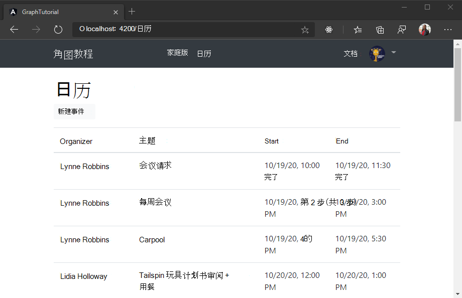

<!-- markdownlint-disable MD002 MD041 -->

<span data-ttu-id="cb517-101">在本练习中, 将把 Microsoft Graph 合并到应用程序中。</span><span class="sxs-lookup"><span data-stu-id="cb517-101">In this exercise you will incorporate the Microsoft Graph into the application.</span></span> <span data-ttu-id="cb517-102">对于此应用程序, 您将使用[microsoft graph 客户端](https://github.com/microsoftgraph/msgraph-sdk-javascript)库调用 microsoft graph。</span><span class="sxs-lookup"><span data-stu-id="cb517-102">For this application, you will use the [microsoft-graph-client](https://github.com/microsoftgraph/msgraph-sdk-javascript) library to make calls to Microsoft Graph.</span></span>

## <a name="get-calendar-events-from-outlook"></a><span data-ttu-id="cb517-103">从 Outlook 获取日历事件</span><span class="sxs-lookup"><span data-stu-id="cb517-103">Get calendar events from Outlook</span></span>

<span data-ttu-id="cb517-104">首先, 创建一个`Event`定义应用程序将显示的字段的类。</span><span class="sxs-lookup"><span data-stu-id="cb517-104">Start by creating an `Event` class that defines the fields that the app will display.</span></span> <span data-ttu-id="cb517-105">在`./src/app`目录中创建一个名`event.ts`为的新文件, 并添加以下代码。</span><span class="sxs-lookup"><span data-stu-id="cb517-105">Create a new file in the `./src/app` directory called `event.ts` and add the following code.</span></span>

```TypeScript
// For a full list of fields, see
// https://docs.microsoft.com/graph/api/resources/event?view=graph-rest-1.0
export class Event {
  subject: string;
  organizer: Recipient;
  start: DateTimeTimeZone;
  end: DateTimeTimeZone;
}

// https://docs.microsoft.com/graph/api/resources/recipient?view=graph-rest-1.0
export class Recipient {
  emailAddress: EmailAddress;
}

// https://docs.microsoft.com/graph/api/resources/emailaddress?view=graph-rest-1.0
export class EmailAddress {
  name: string;
  address: string;
}

// https://docs.microsoft.com/graph/api/resources/datetimetimezone?view=graph-rest-1.0
export class DateTimeTimeZone {
  dateTime: string;
  timeZone: string;
}
```

<span data-ttu-id="cb517-106">接下来, 添加新服务以保存所有图形调用。</span><span class="sxs-lookup"><span data-stu-id="cb517-106">Next, add a new service to hold all of your Graph calls.</span></span> <span data-ttu-id="cb517-107">就像之前创建的身份验证服务一样, 为此创建服务可让您将其插入到需要访问 Microsoft Graph 的任何组件中。</span><span class="sxs-lookup"><span data-stu-id="cb517-107">Just as with the authentication service you created earlier, creating a service for this allows you to inject it into any components that need access to Microsoft Graph.</span></span> <span data-ttu-id="cb517-108">在 CLI 中运行以下命令。</span><span class="sxs-lookup"><span data-stu-id="cb517-108">Run the following command in your CLI.</span></span>

```Shell
ng generate service graph
```

<span data-ttu-id="cb517-109">命令完成后, 打开`./src/app/graph.service.ts`文件并将其内容替换为以下内容。</span><span class="sxs-lookup"><span data-stu-id="cb517-109">Once the command completes, open the `./src/app/graph.service.ts` file and replace its contents with the following.</span></span>

```TypeScript
import { Injectable } from '@angular/core';
import { Client } from '@microsoft/microsoft-graph-client';

import { AuthService } from './auth.service';
import { Event } from './event';
import { AlertsService } from './alerts.service';

@Injectable({
  providedIn: 'root'
})
export class GraphService {

  private graphClient: Client;
  constructor(
    private authService: AuthService,
    private alertsService: AlertsService) {

    // Initialize the Graph client
    this.graphClient = Client.init({
      authProvider: async (done) => {
        // Get the token from the auth service
        let token = await this.authService.getAccessToken()
          .catch((reason) => {
            done(reason, null);
          });

        if (token)
        {
          done(null, token);
        } else {
          done("Could not get an access token", null);
        }
      }
    });
  }

  async getEvents(): Promise<Event[]> {
    try {
      let result =  await this.graphClient
        .api('/me/events')
        .select('subject,organizer,start,end')
        .orderby('createdDateTime DESC')
        .get();

      return result.value;
    } catch (error) {
      this.alertsService.add('Could not get events', JSON.stringify(error, null, 2));
    }
  }
}
```

<span data-ttu-id="cb517-110">考虑此代码执行的操作。</span><span class="sxs-lookup"><span data-stu-id="cb517-110">Consider what this code is doing.</span></span>

- <span data-ttu-id="cb517-111">它在服务的构造函数中初始化 Graph 客户端。</span><span class="sxs-lookup"><span data-stu-id="cb517-111">It initializes a Graph client in the constructor for the service.</span></span>
- <span data-ttu-id="cb517-112">它实现了`getEvents`通过以下方式使用 Graph 客户端的函数:</span><span class="sxs-lookup"><span data-stu-id="cb517-112">It implements a `getEvents` function that uses the Graph client in the following way:</span></span>
  - <span data-ttu-id="cb517-113">将调用的 URL 为`/me/events`。</span><span class="sxs-lookup"><span data-stu-id="cb517-113">The URL that will be called is `/me/events`.</span></span>
  - <span data-ttu-id="cb517-114">此`select`方法将为每个事件返回的字段限制为只是视图实际使用的字段。</span><span class="sxs-lookup"><span data-stu-id="cb517-114">The `select` method limits the fields returned for each events to just those the view will actually use.</span></span>
  - <span data-ttu-id="cb517-115">`orderby`方法按其创建日期和时间对结果进行排序, 最新项目最先开始。</span><span class="sxs-lookup"><span data-stu-id="cb517-115">The `orderby` method sorts the results by the date and time they were created, with the most recent item being first.</span></span>

<span data-ttu-id="cb517-116">现在, 创建一个角度组件来调用此新方法, 并显示该调用的结果。</span><span class="sxs-lookup"><span data-stu-id="cb517-116">Now create an Angular component to call this new method and display the results of the call.</span></span> <span data-ttu-id="cb517-117">在 CLI 中运行以下命令。</span><span class="sxs-lookup"><span data-stu-id="cb517-117">Run the following command in your CLI.</span></span>

```Shell
ng generate component calendar
```

<span data-ttu-id="cb517-118">命令完成后, 将组件添加到中`routes` `./src/app/app-routing.module.ts`的阵列。</span><span class="sxs-lookup"><span data-stu-id="cb517-118">Once the command completes, add the component to the `routes` array in `./src/app/app-routing.module.ts`.</span></span>

```TypeScript
import { CalendarComponent } from './calendar/calendar.component';

const routes: Routes = [
  { path: '', component: HomeComponent },
  { path: 'calendar', component: CalendarComponent }
];
```

<span data-ttu-id="cb517-119">打开`./src/app/calendar/calendar.component.ts`文件, 并将其内容替换为以下内容。</span><span class="sxs-lookup"><span data-stu-id="cb517-119">Open the `./src/app/calendar/calendar.component.ts` file and replace its contents with the following.</span></span>

```TypeScript
import { Component, OnInit } from '@angular/core';
import * as moment from 'moment-timezone';

import { GraphService } from '../graph.service';
import { Event, DateTimeTimeZone } from '../event';
import { AlertsService } from '../alerts.service';

@Component({
  selector: 'app-calendar',
  templateUrl: './calendar.component.html',
  styleUrls: ['./calendar.component.css']
})
export class CalendarComponent implements OnInit {

  private events: Event[];

  constructor(
    private graphService: GraphService,
    private alertsService: AlertsService) { }

  ngOnInit() {
    this.graphService.getEvents()
      .then((events) => {
        this.events = events;
        // Temporary to display raw results
        this.alertsService.add('Events from Graph', JSON.stringify(events, null, 2));
      });
  }
}
```

<span data-ttu-id="cb517-120">现在, 这只是在页面上呈现 JSON 中的事件数组。</span><span class="sxs-lookup"><span data-stu-id="cb517-120">For now this just renders the array of events in JSON on the page.</span></span> <span data-ttu-id="cb517-121">保存更改并重新启动该应用。</span><span class="sxs-lookup"><span data-stu-id="cb517-121">Save your changes and restart the app.</span></span> <span data-ttu-id="cb517-122">登录并单击导航栏中的 "**日历**" 链接。</span><span class="sxs-lookup"><span data-stu-id="cb517-122">Sign in and click the **Calendar** link in the nav bar.</span></span> <span data-ttu-id="cb517-123">如果一切正常, 应在用户的日历上看到一个 JSON 转储的事件。</span><span class="sxs-lookup"><span data-stu-id="cb517-123">If everything works, you should see a JSON dump of events on the user's calendar.</span></span>

## <a name="display-the-results"></a><span data-ttu-id="cb517-124">显示结果</span><span class="sxs-lookup"><span data-stu-id="cb517-124">Display the results</span></span>

<span data-ttu-id="cb517-125">现在, 您可以更新`CalendarComponent`组件以以更用户友好的方式显示事件。</span><span class="sxs-lookup"><span data-stu-id="cb517-125">Now you can update the `CalendarComponent` component to display the events in a more user-friendly manner.</span></span> <span data-ttu-id="cb517-126">首先, 从`ngOnInit`函数中移除添加警报的临时代码。</span><span class="sxs-lookup"><span data-stu-id="cb517-126">First, remove the temporary code that adds an alert from the `ngOnInit` function.</span></span> <span data-ttu-id="cb517-127">更新的函数应如下所示。</span><span class="sxs-lookup"><span data-stu-id="cb517-127">Your updated function should look like this.</span></span>

```TypeScript
ngOnInit() {
  this.graphService.getEvents()
    .then((events) => {
      this.events = events;
    });
}
```

<span data-ttu-id="cb517-128">现在, 向`CalendarComponent`类中添加函数, 以将`DateTimeTimeZone`对象格式化为 ISO 字符串。</span><span class="sxs-lookup"><span data-stu-id="cb517-128">Now add a function to the `CalendarComponent` class to format a `DateTimeTimeZone` object into an ISO string.</span></span>

```TypeScript
formatDateTimeTimeZone(dateTime: DateTimeTimeZone): string {
  try {
    return moment.tz(dateTime.dateTime, dateTime.timeZone).format();
  }
  catch(error) {
    this.alertsService.add('DateTimeTimeZone conversion error', JSON.stringify(error));
  }
}
```

<span data-ttu-id="cb517-129">最后, 打开`./src/app/calendar/calendar.component.html`文件, 并将其内容替换为以下内容。</span><span class="sxs-lookup"><span data-stu-id="cb517-129">Finally, open the `./src/app/calendar/calendar.component.html` file and replace its contents with the following.</span></span>

```html
<h1>Calendar</h1>
<table class="table">
  <thead>
    <th scope="col">Organizer</th>
    <th scope="col">Subject</th>
    <th scope="col">Start</th>
    <th scope="col">End</th>
  </thead>
  <tbody>
    <tr *ngFor="let event of events">
      <td>{{event.organizer.emailAddress.name}}</td>
      <td>{{event.subject}}</td>
      <td>{{formatDateTimeTimeZone(event.start) | date:'short' }}</td>
      <td>{{formatDateTimeTimeZone(event.end) | date: 'short' }}</td>
    </tr>
  </tbody>
</table>
```

<span data-ttu-id="cb517-130">这将遍历事件集合并为每个事件添加一个表行。</span><span class="sxs-lookup"><span data-stu-id="cb517-130">This loops through the collection of events and adds a table row for each one.</span></span> <span data-ttu-id="cb517-131">保存所做的更改, 然后重新启动应用程序。</span><span class="sxs-lookup"><span data-stu-id="cb517-131">Save the changes and restart the app.</span></span> <span data-ttu-id="cb517-132">单击 "**日历**" 链接, 应用现在应呈现一个事件表。</span><span class="sxs-lookup"><span data-stu-id="cb517-132">Click on the **Calendar** link and the app should now render a table of events.</span></span>

